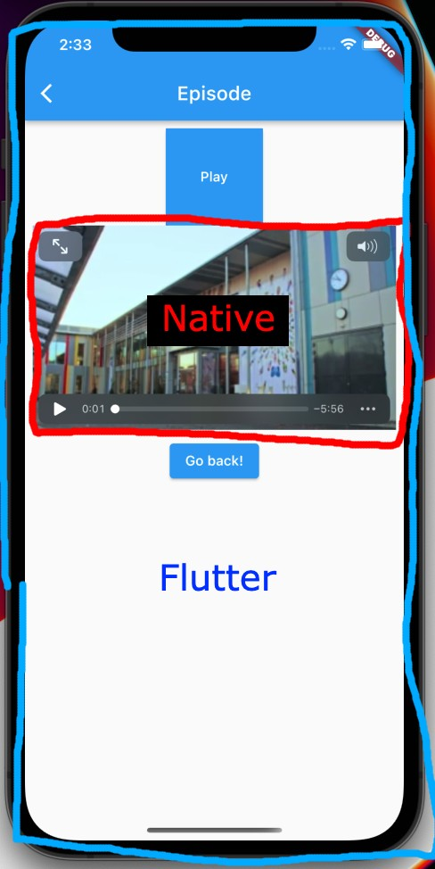

# Flutter ADR

Created: July 8, 2022 9:11 AM

# Introduction and context

For strategic reasons, we are moving app development in-house. Because the app is currently being developed remotely by consultants in Poland, we have practically no development experience with the existing app and technology. We are also rearchitecting the BrunstadTV app to have a more server-driven UI, which requires rewriting a significant portion of the app’s code.

Our goal is that we should be able to develop new apps with different UIs and iterate quickly on new features **with a very small team**, and without compromising on functionality or performance. We need an ecosystem where we feel confident to do that.

Some key requirements to enable us to do this are:

- Development speed: The method must allow us to move fast, especially when it comes to UI and logic, as we expect that to change more than e.g. video playback.
- Native code interoperability: We need to be able to write native iOS and Android code with low effort, so that we can optimize where necessary, and to be able to use niche third-party libraries. This is especially for video playback.

# Why Flutter

## How it works

To start, we will explain how Flutter is architecturally different from the other big cross-platform frameworks. For UI, Xamarin and React Native wrap native components like “UIButton” on iOS and allow you to use and configure them with C#/Javascript. The OS is responsible for rendering the UI components as you configured them.

Flutter has a different approach, where it manages the entire rendering of the UI itself. So to the OS, the flutter UI is just a flat texture layer it needs to display on the screen. This gives a few underlying benefits:

- The UI looks exactly the same on all platforms (but you can override if you want).
- The UI is free from the OS, so if an OS update has changes to some components, we don’t need to wait for flutter to update its native bindings and make them backwards compatible.
- Transitions, animations and graphic workflow is simplified, as everything is managed by the same engine.

Another key feature is that Flutter uses code generation to ensure that it doesn’t take ownership of the native app, allowing us to own the projects and write native code as if flutter wasn’t there.

With flutter you write code in a language called Dart, which is strongly typed, compiled, and easy to learn as it’s similar to Javascript.

## Development speed

Flutter as a whole is very lightweight, easy to learn and understand. You don’t need a complicated IDE, it’s enough to have a simple code editor and the flutter CLI. The documentation is also very good.

With the UI being handled by flutter, the app will look the same on all platforms, making implementation simpler and requiring less testing and bugfixing of edge cases related to UI.

You don’t need a separate language like XML or JSX to write the UI, everything is just Dart. The UI is built _declaratively_, which is familiar from web frameworks like React or Vue. This means that your job is to declare how the UI should layout and look and which variables to use where, while Flutter’s job is to automatically react to changes and ensure that the UI looks according to how you declared it. This is significantly faster and cleaner to work with than the traditional approach where you manually control all components’ changes/deletions/creations.

Layout and styling is also very intuitive and straightforward.

## Native interoperability

As mentioned, flutter doesn’t control the app’s native iOS/Android entrypoints, and flutter is only a modular part of the app, which means that we can do whatever we want outside of it.

It’s also easy to setup type-safe programmatic communication between the dart runtime and native code. It’s easy to debug the native code.

Embedding native views like a native video player within the flutter UI is possible, but see details about performance risks under “Consequences”.

## Other

Flutter has a very good reputation and a strong showcase of users. Some notable apps are Alibaba, Stadia, Google Pay, BMW, eBay, Rive, Sua Musica.

Flutter for web is stable. This means we can create both a native app and a web-app with shared code. Building web-apps with flutter makes them feel more “app-like”, which in certain cases may be desired. Flutter for web has some drawbacks like SEO, so going for this would require further research.

# Consequences

### Performance risks when embedding native components

As mentioned, there can be some overhead in embedding native views inside flutter. To be clear, by embedding, we mean mixing native components with flutter components, so that the native component’s position, size, opacity, etc is controlled by flutter.

Embedding

Flutter has three different approaches to do this:

- Textures: Render pixels to a texture, like a video, and display it in flutter. Interaction does not work with this, and this creates some extra copy work for the CPU. Interesting article describing some of the issue: [Rendering “External Texture”: A Flutter Optimization Story | by Alibaba Tech | HackerNoon.com | Medium](https://medium.com/hackernoon/rendering-external-texture-an-flutter-optimization-by-alibaba-c5ed143af747)
- Virtual display: Flutter renders the native view and displays it via flutter’s rendering engine. “Virtual display […] makes each pixel of the native view flow through additional intermediate graphic buffers, which cost graphic memory and drawing performance.” ([ref](https://docs.flutter.dev/development/platform-integration/android/platform-views?tab=android-platform-views-kotlin-tab#performance))
- Hybrid composition: Placing the native views into the native view hierarchy, synchronizing position and size. Flutter detects any overlaps and adds extra layers above if necessary. This has performance issues especially on Android 9 and below (phones older than 2018-ish). However, this is being actively developed and improved. See th[e Evolution of Flutter PlatformView | by GSYTech | Medium](https://medium.com/@GSYTech/the-evolution-of-flutter-platformview-8486e9cd62d3).

With flutter 3 hybrid composition, there’s issues on android [when the native view has surfaces.](https://github.com/flutter/flutter/issues/103630) We use exoplayer, which you can configure to use _texture_ instead of _surface_ under the hood, but this [is less performant and doesn’t support DRM](https://source.android.com/devices/graphics/arch-tv) (which we might need at some point).

For many use cases, these performance issues seem negligible, but as we are working with 50fps HD video playback, performance is essential. These issues are almost enough for us to drop flutter in favor of other frameworks. However, these issues only affect embedding within flutter’s UI, so full-screen playback is fully native and plays smoothly.

With that said, we **have** tested video playback with virtual display, and we only saw minor stuttering on lower-end android devices. Therefore, for our use case, we have concluded that this shouldn’t be an issue. If it turns out to be an actual issue, we have 2 very viable workarounds:

- Don’t embed video with flutter. It’s not uncommon for streaming apps to only have generic episode pages and have fullscreen-only video playback.
- Implement the problematic pages with fully-native code. Potential scenarios could be a scrolling feed of videos, or some instagram-like story view. These pages could be implemented fully native.

We have thought it through and concluded that these risks are acceptable tradeoffs for the speed of development, developer experience and user experience we get from building the core UI with flutter.

### Risk of google dropping support

Google is known for [ending products after a while](https://killedbygoogle.com/), so this might not be too unrealistic. But the risk should be very low, seeing as they have invested in it heavily themselves, e.g. Google Pay, Stadia. Even the UI for their new OS Fuchsia is made with Flutter. Fuchsia is used on Google Nest Hubs for now.

### Not supported on AppleTV / AndroidTV

This isn’t that big of a deal because UI will be entirely different anyway, as these platforms has special components and a different look to optimize for the TV experience.

We have estimated that developing the BrunstadTV tvOS app natively will take approximately 2 months from start to release.

### Delay before we can use new OS features

This depends on the feature. If it’s a simple feature, it’s easy because we can write native code. But if it’s a complicated feature, we might want to wait for someone else to make a flutter plugin for it. If it’s some sort of UI feature, we of course _can’t_ use it within flutter.

# Alternatives

## Xamarin / MAUI

Xamarin isn’t a bad framework. It gives you the dev-speed advantages of cross-platform development and C# is a good language. The biggest drawbacks for us is that it’s significantly harder to write native code, which in turn means it’s harder to customize the playback experience, it’s harder to use third-party SDKs that doesn’t have an existing Xamarin integration, etc. Other than that, it’s a bit heavy on the tooling side, and it’s harder to write UI than flutter (e.g. you need to ensure it behaves correctly on multiple platforms). [The customer showcase for Xamarin](https://dotnet.microsoft.com/en-us/platform/customers/xamarin) doesn’t show any particularly interesting or innovative companies.

## Native

This is the approach that gives the most performance and most flexibility. If we were to realistically go for this path, we would need a quick way to build and adapt the UIs, so we would probably _have_ to use SwiftUI and Jetpack Compose, which are first-party toolkits for declarative UI development (similar to flutter). These were released only a few years ago, but significantly speeds up UI development.

SwiftUI is a bit scary because of how they do versioning; any new features are tied to a specific iOS version, because it’s [a system-provided framework](https://developer.apple.com/forums/thread/649834?answerId=613922022#613922022). This means in practice that you need to be careful which components/apis you use to ensure backwards compatibility, and bugfixes will follow iOS versions. Jetpack Compose updates aren’t tied to the OS-version, so it’s backwards compatible to minimum android 5.

When writing native, some of the code could be shared with an AppleTV and AndroidTV app.

The biggest issues we see for going native is the slower speed of development and the higher skill requirements. Any new app UI needs to be implemented **twice**, in two completely different ecosystems. This would either require 2 dedicated developers or one very skilled app developer to maintain the apps. There are a lot of other downsides that comes from having two different ecosystems; it means twice as many pitfalls, new contributors would need significantly more time to get up-to-speed, the platforms have a risk of becoming inconsistent with eachother, etc.

## Other alternatives

Native and Xamarin were the main alternatives we evaluated, but we also briefly considered PWA, cordova/capacitor (web-based native apps), React Native and Kotlin Multiplatform.

For PWA and cordova/capacitor, even though they would allow us to move faster, we believe apps based on web-technology (the DOM) are hard to get right in terms of performance and user experience.

React Native (this is _not_ the same as React) wraps native components similarly to Xamarin, and even wins versus Xamarin on certain fronts: you have access to the native entrypoints, bigger community, and you can share code with web. On the other hand, React Native uses the javascript/typescript ecosystem which has some drawbacks, e.g. runtime type-safety, slower performance.

Kotlin Multiplatform is interesting as it allows you to write kotlin for backend logic even on iOS. However, for UI you still write natively, so it shares the drawbacks mentioned under “Native”. It just recently went from alpha to beta, so it’s probably too young anyway.
